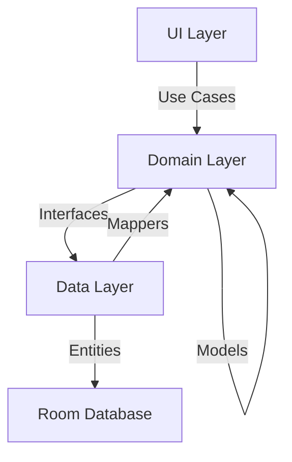

# 🎯 Core Module | Основна Бізнес-Логіка

## 📋 Призначення

Модуль **core** містить фундаментальну бізнес-логіку та шар даних застосунку. Реалізує принципи Clean Architecture з чітким розділенням Domain та Data шарів.

## 🏗️ Структура

```
core/
├── domain/              # Бізнес-логіка (чиста, без Android)
│   └── src/main/kotlin/com/quantumforce_code/core/domain/
│       ├── UseCase.kt            - Базовий клас для бізнес-операцій
│       ├── Vehicle.kt            - Модель автомобіля
│       ├── DtcCode.kt            - Модель діагностичного коду
│       └── DiagnosticSession.kt  - Модель сесії діагностики
│
├── data/                # Шар даних (Room, репозиторії)
│   └── src/main/kotlin/com/quantumforce_code/core/data/
│       ├── db/
│       │   ├── AppDatabase.kt    - Room Database
│       │   └── DtcDao.kt         - Data Access Object
│       ├── repo/
│       │   ├── DtcRepository.kt  - Репозиторій DTC кодів
│       │   └── VehicleRepository.kt - Репозиторій автомобілів
│       └── DataMappers.kt        - Маперы між шарами
│
└── test/                # Unit тести
    └── DataUnitTests.kt
```

## 🧠 Domain Layer (Доменний Шар)

### Філософія
- **Чистий Kotlin**: Без залежностей від Android Framework
- **Business Logic Only**: Тільки бізнес-правила
- **Platform Independent**: Може використовуватись в інших платформах

### Компоненти

#### UseCase.kt
```kotlin
// 1. File Purpose: Base class for business operations
// 2. Role: Defines contract for all use cases in domain layer

abstract class UseCase<in P, out R> {
    abstract suspend fun execute(params: P): Result<R>
}
```

#### Vehicle.kt
- **Модель**: Представлення автомобіля
- **Поля**: `id`, `make`, `model`, `year`, `vin`
- **Використання**: Ідентифікація автомобіля в діагностиці

#### DtcCode.kt
- **Модель**: Діагностичний код несправності
- **Поля**: `code`, `description`, `causes`, `severity`
- **Використання**: Зберігання та аналіз DTC

#### DiagnosticSession.kt
- **Модель**: Сесія діагностики
- **Поля**: `id`, `vehicleId`, `timestamp`, `dtcCodes`, `status`
- **Використання**: Історія діагностик

### Залежності
```kotlin
dependencies {
    implementation(libs.kotlin.stdlib)
    implementation(libs.kotlinx.coroutines.core)
}
```

## 💾 Data Layer (Шар Даних)

### Філософія
- **Single Source of Truth**: Room як основне джерело даних
- **Repository Pattern**: Абстракція доступу до даних
- **Offline First**: Пріоритет локальних даних

### Компоненти

#### AppDatabase.kt
```kotlin
// 1. File Purpose: Room database configuration
// 2. Role: Central database for vehicle diagnostics data

@Database(
    entities = [DtcEntity::class, VehicleEntity::class],
    version = 1
)
abstract class AppDatabase : RoomDatabase() {
    abstract fun dtcDao(): DtcDao
    abstract fun vehicleDao(): VehicleDao
}
```

#### Repositories
- **DtcRepository**: CRUD операції для DTC кодів
- **VehicleRepository**: Управління інформацією про автомобілі

#### DataMappers.kt
- **Роль**: Перетворення між DB entities та Domain models
- **Напрямки**: Entity → Model, Model → Entity

### Залежності
```kotlin
dependencies {
    implementation(project(":core:domain"))
    
    implementation(libs.androidx.room.runtime)
    implementation(libs.androidx.room.ktx)
    kapt(libs.androidx.room.compiler)
    
    implementation(libs.kotlinx.coroutines.android)
}
```

## 🔗 Взаємодія Шарів



## 🧪 Тестування

### Unit Tests
- Domain моделей
- Use Cases логіка
- Репозиторії (з фейковими DAO)
- Мапери

```bash
# Запуск тестів
./gradlew :core:domain:test
./gradlew :core:data:test
```

## 📊 Моделі Даних

### Vehicle (Автомобіль)
```kotlin
data class Vehicle(
    val id: String,
    val make: String,      // Марка (e.g., "Toyota")
    val model: String,     // Модель (e.g., "Camry")
    val year: Int,         // Рік випуску
    val vin: String        // VIN код (17 символів)
)
```

### DtcCode (Діагностичний Код)
```kotlin
data class DtcCode(
    val code: String,           // e.g., "P0420"
    val description: String,    // Опис несправності
    val causes: List<String>,   // Можливі причини
    val severity: Severity      // Критичність
)

enum class Severity { LOW, MEDIUM, HIGH, CRITICAL }
```

### DiagnosticSession (Сесія Діагностики)
```kotlin
data class DiagnosticSession(
    val id: String,
    val vehicleId: String,
    val timestamp: Long,
    val dtcCodes: List<DtcCode>,
    val status: SessionStatus
)

enum class SessionStatus { ACTIVE, COMPLETED, ERROR }
```

## 🔐 Принципи

1. **Dependency Rule**: Domain не залежить від Data
2. **Interface Segregation**: Маленькі, фокусовані інтерфейси
3. **Single Responsibility**: Один клас = одна відповідальність
4. **Testability**: Весь код покритий тестами (>85%)

## 📚 Додаткові Ресурси

- [Clean Architecture](https://blog.cleancoder.com/uncle-bob/2012/08/13/the-clean-architecture.html)
- [Room Database Guide](https://developer.android.com/training/data-storage/room)
- [Repository Pattern](https://developer.android.com/codelabs/basic-android-kotlin-training-repository-pattern)

---

**Пакет**: `com.quantumforce_code.core`  
**Модулі**: `domain`, `data`, `test`  
**Архітектура**: Clean Architecture
