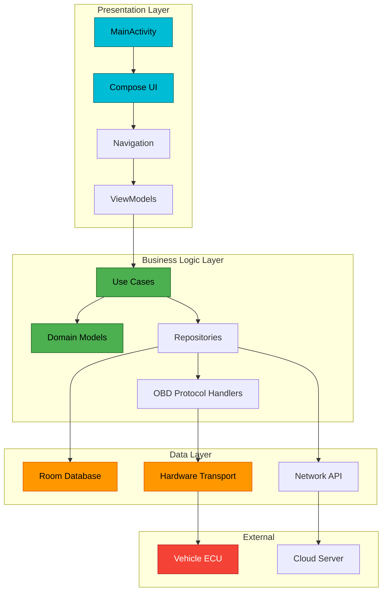
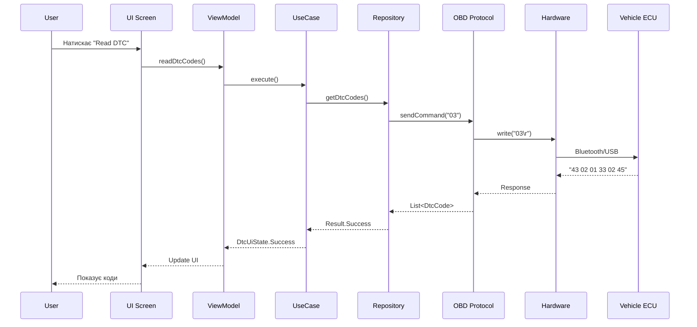
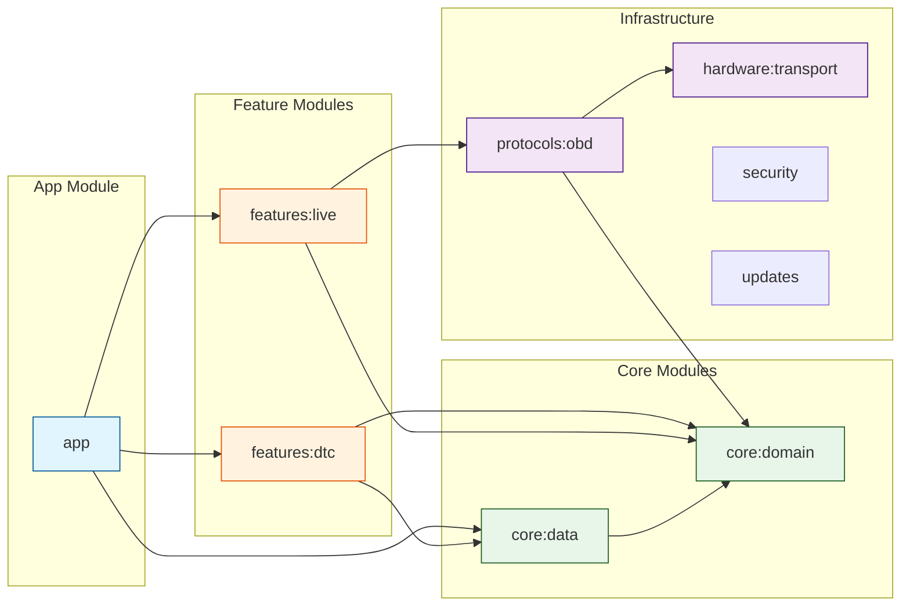
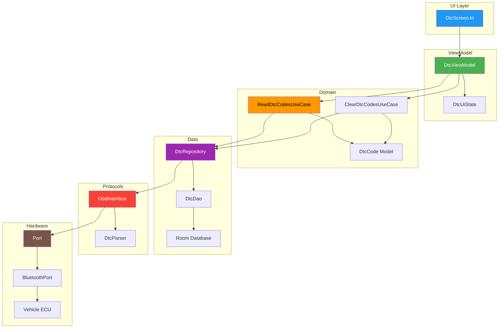
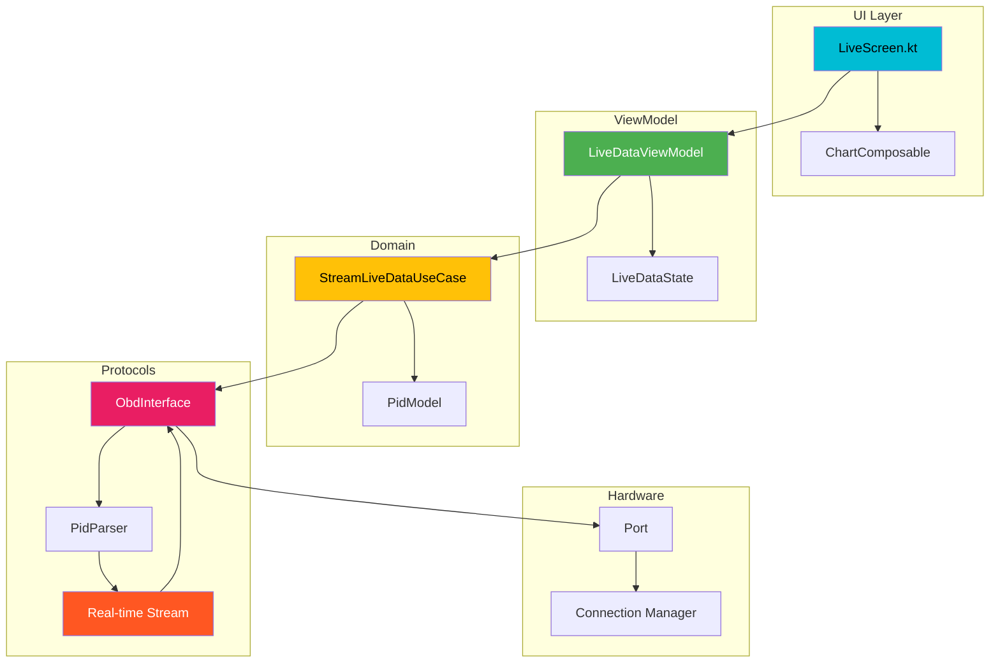
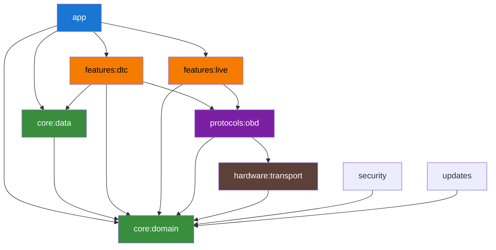
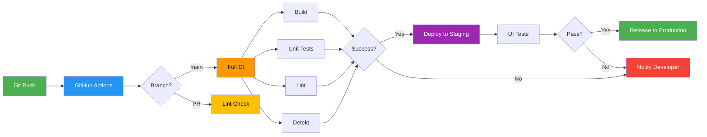
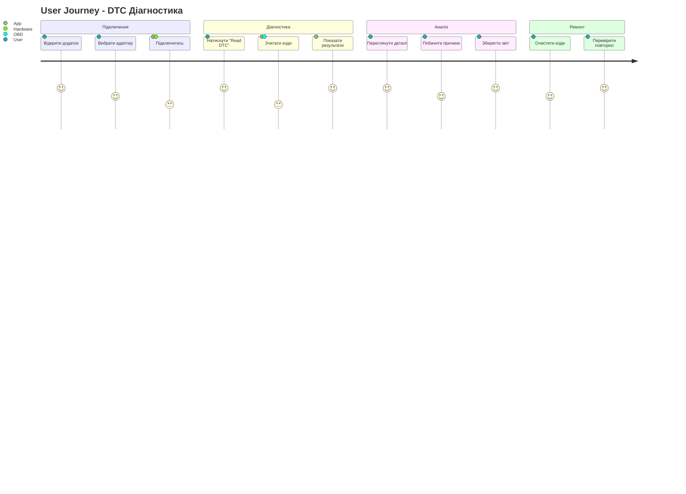
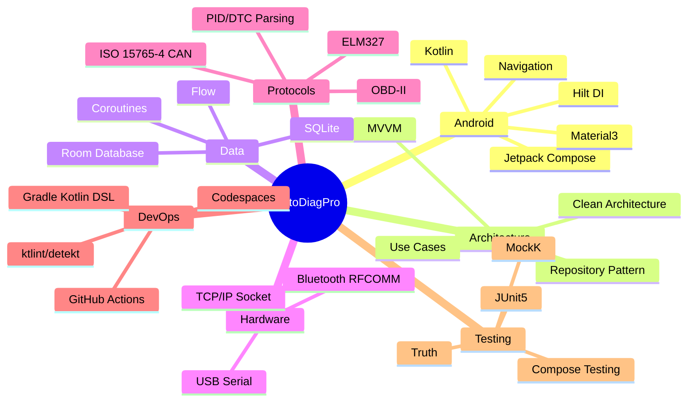

# 🎨 Architecture Visualization | Візуалізація Архітектури

## 📊 Системна Архітектура

### 1. Загальна Трирівнева Архітектура

### 2. Потік Даних (Data Flow)

### 3. Модульна Структура

### 4. DTC Feature Архітектура

### 5. Live Data Feature Архітектура

### 6. Dependency Graph (Gradle)

### 7. CI/CD Pipeline

### 8. Ролі AI Агентів

```mermaid
graph TB
    subgraph "AI Agent Ecosystem"
        A[RepoBuilder]
        B[UI Agent]
        C[Data Agent]
        D[Protocols Agent]
        E[Transport Agent]
        F[Security Reviewer]
    end
    
    subgraph "Responsibilities"
        A --> A1[DevContainer Setup]
        A --> A2[CI/CD Config]
        A --> A3[Build Management]
        
        B --> B1[Compose UI]
        B --> B2[Navigation]
        B --> B3[Accessibility]
        
        C --> C1[Room DB]
        C --> C2[Repositories]
        C --> C3[Data Mappers]
        
        D --> D1[OBD Protocol]
        D --> D2[PID Parsing]
        D --> D3[DTC Parsing]
        
        E --> E1[Bluetooth]
        E --> E2[USB Serial]
        E --> E3[TCP/IP]
        
        F --> F1[Code Review]
        F --> F2[Threat Analysis]
        F --> F3[Audit]
    end
    
    style A fill:#00BCD4,color:#000
    style B fill:#4CAF50,color:#fff
    style C fill:#FF9800,color:#000
    style D fill:#9C27B0,color:#fff
    style E fill:#F44336,color:#fff
    style F fill:#795548,color:#fff
```

### 9. Користувацькі Сценарії

### 10. Стек Технологій

---

## 🎨 Кольорова Палітра

### Primary Colors
- **Primary**: `#00BCD4` (Cyan) - Головні елементи
- **Primary Variant**: `#0097A7` - Акценти
- **Secondary**: `#4CAF50` (Green) - Успішні стани
- **Secondary Variant**: `#388E3C` - Підтвердження

### Functional Colors
- **Error**: `#F44336` (Red) - Помилки, критичні DTC
- **Warning**: `#FF9800` (Orange) - Попередження
- **Info**: `#2196F3` (Blue) - Інформація
- **Success**: `#4CAF50` (Green) - Успіх

### Background
- **Background**: `#121212` - Темний фон
- **Surface**: `#1E1E1E` - Картки
- **Surface Variant**: `#2C2C2C` - Вторинні поверхні

### Text
- **On Primary**: `#000000` - Текст на primary
- **On Background**: `#FFFFFF` - Основний текст
- **On Surface**: `#E0E0E0` - Текст на картках

---

## 📐 Типографія

### Font Families
- **Display**: Roboto Bold - Заголовки
- **Body**: Roboto Regular - Основний текст
- **Monospace**: Roboto Mono - Технічні дані, коди

### Sizes
- **H1**: 32sp - Головні заголовки
- **H2**: 24sp - Секційні заголовки
- **Body1**: 16sp - Основний текст
- **Body2**: 14sp - Вторинний текст
- **Caption**: 12sp - Підписи

---

**Оновлено**: 2025-01-07  
**Версія**: 1.0  
**Автор**: AI Agent Ecosystem
