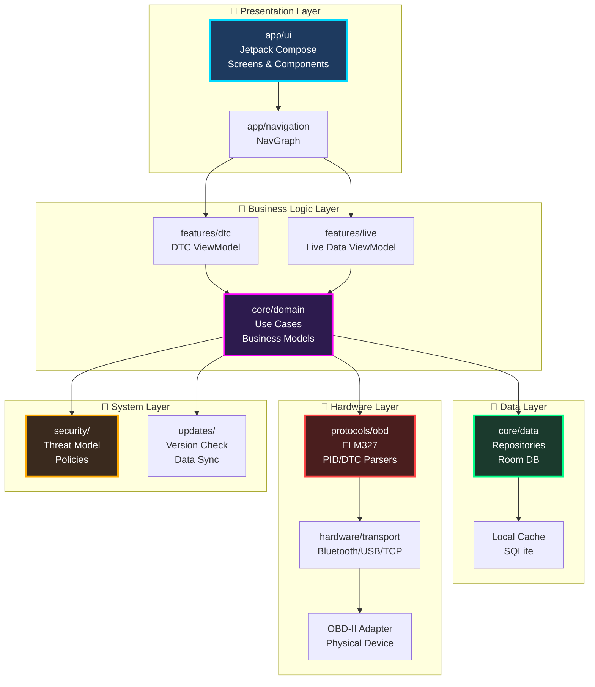
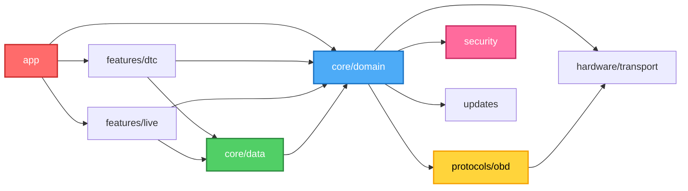
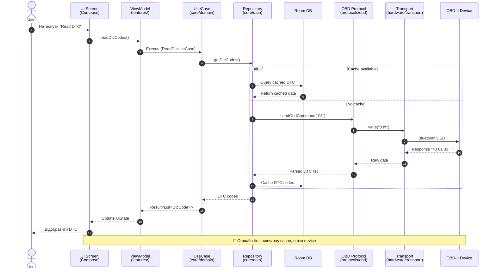
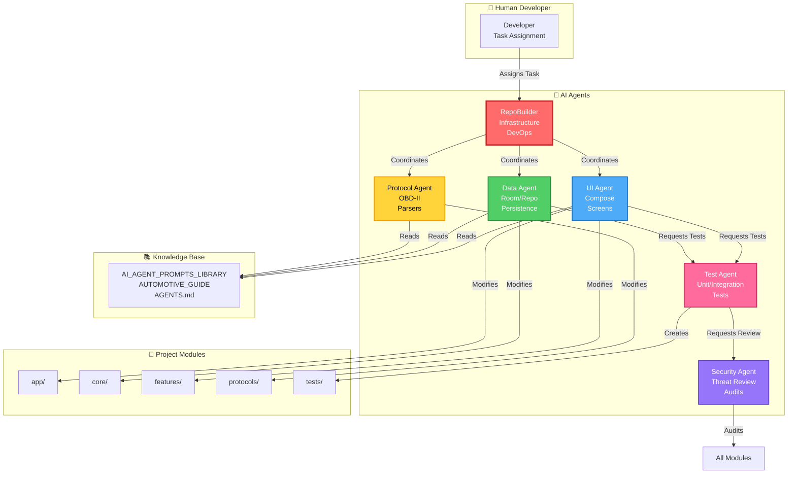

# 🏗️ QuantumForce_Code Architecture Visualization | Архітектурна Візуалізація

## 📋 File Purpose | Призначення
Візуальне представлення архітектури проекту AutoDiagPro з діаграмами модулів, потоків даних та взаємодій.

## 🎯 Role | Роль
Надає швидке розуміння структури проекту для нових розробників та AI-агентів.

---

## 🏛️ High-Level Architecture | Загальна Архітектура



**Опис шарів / Layer Description:**
- **Presentation:** UI компоненти (Jetpack Compose), навігація
- **Business Logic:** ViewModel, Use Cases, domain моделі
- **Data:** Репозиторії, Room DB, кешування
- **Hardware:** Протоколи OBD-II, транспортні інтерфейси
- **System:** Безпека, оновлення, логування

---

## 📦 Module Dependencies | Залежності Модулів



**Правила залежностей / Dependency Rules:**
- ✅ `app` може залежати від всіх `features/`
- ✅ `features/` може залежати від `core/`
- ✅ `core/domain` - незалежний (чиста бізнес-логіка)
- ✅ `core/data` → `core/domain` (тільки в одному напрямку)
- ❌ `core/` не може залежати від `features/` або `app`

---

## 🔄 Data Flow Diagram | Діаграма Потоку Даних



**Ключові принципи / Key Principles:**
1. **Offline-first:** Завжди спочатку перевіряємо кеш
2. **Unidirectional flow:** Дані течуть UI → ViewModel → Domain → Data
3. **Result wrapping:** Всі операції повертають `Result<T>` для error handling

---

## 🤖 AI Agents Interaction | Взаємодія AI-Агентів



**Ролі агентів / Agent Roles:**
- **RepoBuilder:** Інфраструктура, CI/CD, координація
- **UI Agent:** Jetpack Compose, навігація, UI-компоненти
- **Data Agent:** Room, репозиторії, кешування
- **Protocol Agent:** OBD-II, парсери, hardware integration
- **Test Agent:** Unit/integration тести, coverage
- **Security Agent:** Threat modeling, code audit

---

## 📁 Directory Tree Visualization | Дерево Директорій

```
QuantumForce_Code/
│
├── 📱 app/                      # Android Application (APK)
│   ├── 🎨 ui/                   # Jetpack Compose UI
│   │   ├── screens/             # DashboardScreen, DtcScreen, LiveScreen
│   │   └── components/          # Reusable UI components
│   ├── 🧭 navigation/           # NavGraph (Navigation Compose)
│   └── 📦 AndroidManifest.xml
│
├── 🧠 core/                     # Core Business Logic
│   ├── 💼 domain/               # Use Cases, Business Models
│   │   ├── UseCase.kt
│   │   ├── Vehicle.kt
│   │   └── DtcCode.kt
│   └── 💾 data/                 # Data Layer
│       ├── db/                  # Room Database
│       └── repo/                # Repositories
│
├── ⚡ features/                 # Feature Modules
│   ├── 🔴 dtc/                  # DTC Reading Feature
│   │   ├── DtcViewModel.kt
│   │   └── DtcUiState.kt
│   └── 📊 live/                 # Live Data Feature
│       ├── LiveDataViewModel.kt
│       └── LiveChartRenderer.kt
│
├── 🔌 hardware/                 # Hardware Integration
│   └── transport/               # Physical Connections
│       ├── Port.kt              # Abstract interface
│       ├── BluetoothPort.kt     # Bluetooth RFCOMM
│       ├── UsbSerialPort.kt     # USB OTG
│       └── TcpPort.kt           # Wi-Fi/TCP
│
├── 🛰️ protocols/                # Diagnostic Protocols
│   └── obd/                     # OBD-II Standard
│       ├── ObdInterface.kt
│       ├── Elm327.kt            # ELM327 adapter
│       ├── PidParser.kt         # PID responses
│       └── DtcParser.kt         # DTC codes
│
├── 🔐 security/                 # Security Module
│   ├── ThreatModel.md
│   └── SecurityPolicy.kt
│
├── 🔄 updates/                  # Update System
│   ├── UpdateChecker.kt
│   └── DataVersion.kt
│
├── 📚 docs/                     # Documentation
│   ├── architecture.md
│   ├── roadmap.md
│   └── adr/                     # Architecture Decision Records
│
├── 🤖 prompts/                  # AI Agent Prompts
│   ├── ui-agent-start.md
│   ├── data-agent-start.md
│   └── protocols-agent-start.md
│
└── ⚙️ scripts/                  # Automation Scripts
    ├── verify-local.sh          # Pre-PR checks
    └── run-tests.sh             # Test runner
```

---

## 🎨 Color Coding | Кольорова Кодування

### By Layer Type
- 🔵 **Blue (#1e3a5f):** UI/Presentation layer
- 🟣 **Purple (#2d1b4e):** Business Logic layer
- 🟢 **Green (#1b3a2d):** Data/Persistence layer
- 🔴 **Red (#4a1e1e):** Hardware/Protocols layer
- 🟡 **Orange (#3a2a1e):** Security/System layer

### By Component Type
- 📱 **App:** Main Android module
- 🧠 **Core:** Domain + Data
- ⚡ **Features:** Feature modules (dtc, live)
- 🔌 **Hardware:** Physical interfaces
- 🛰️ **Protocols:** Communication protocols
- 🔐 **Security:** Security policies
- 📚 **Docs:** Documentation
- 🤖 **Prompts:** AI agent prompts

---

## 🔗 Export Formats | Формати Експорту

### Mermaid Live Editor
1. Скопіювати будь-який `mermaid` блок
2. Відкрити [Mermaid Live Editor](https://mermaid.live/)
3. Вставити код
4. Експортувати: SVG, PNG, PDF

### GitHub Markdown
Діаграми автоматично рендеряться у GitHub Markdown (цей файл).

### VS Code
Використати extension: `Markdown Preview Mermaid Support`

### PlantUML (альтернатива)
Можна конвертувати у PlantUML для більш складних діаграм.

---

## 📖 Додаткові Діаграми / Additional Diagrams

Детальні діаграми для окремих компонентів:
- `OBD_PROTOCOL_FLOW.md` - Детальний flow OBD-II команд
- `ROOM_DATABASE_SCHEMA.md` - Схема БД з таблицями
- `COMPOSE_UI_TREE.md` - Дерево UI-компонентів
- `HILT_DI_GRAPH.md` - Граф Dependency Injection

---

**Generated by:** RepoBuilder AI Agent 🤖  
**Tools:** Mermaid.js, Markdown  
**Last Updated:** 2025 🚦⚡  
**Style:** Cyberpunk Tech Noir 🌃🔥
