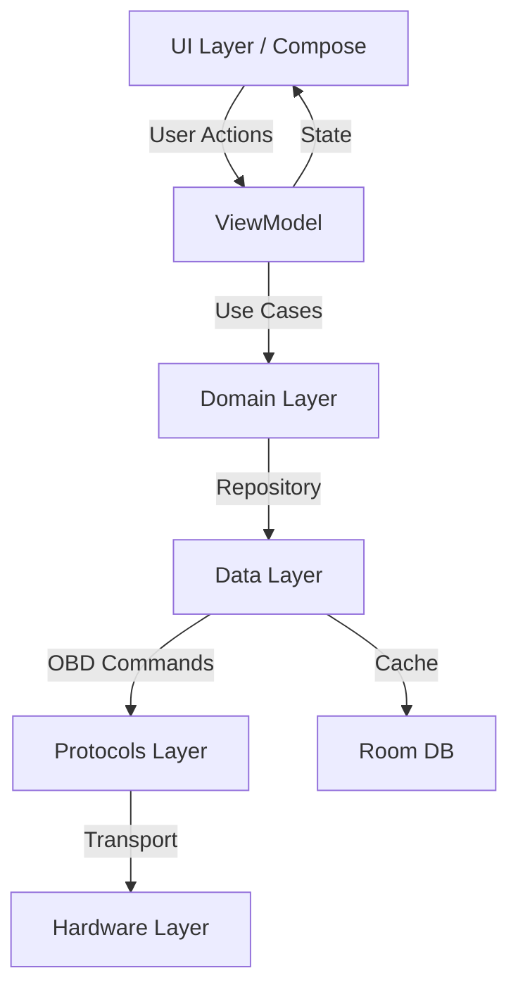

# ⚙️ Features Module | Функціональні Модулі

## 📋 Призначення

Модуль **features** містить окремі функціональні блоки застосунку з власною UI-логікою, ViewModels та бізнес-правилами. Кожна feature є самодостатнім модулем.

## 🏗️ Структура

```
features/
├── dtc/                           # DTC Діагностика
│   ├── src/main/kotlin/com/quantumforce_code/features/dtc/
│   │   ├── DtcViewModel.kt        - ViewModel для DTC екрану
│   │   ├── DtcScreenModel.kt      - Модель екрану
│   │   ├── DtcUiState.kt          - UI стан (loading, data, error)
│   │   └── DtcRepositoryBridge.kt - Міст до core/data
│   └── build.gradle.kts
│
└── live/                          # Live Data Моніторинг
    ├── src/main/kotlin/com/quantumforce_code/features/live/
    │   ├── LiveDataViewModel.kt   - ViewModel для live екрану
    │   ├── LiveChartRenderer.kt   - Рендеринг графіків
    │   └── LiveRepositoryBridge.kt - Доступ до даних
    └── build.gradle.kts
```

## 🔧 DTC Feature | Діагностичні Коди

### Призначення
Читання, відображення та аналіз Diagnostic Trouble Codes (DTC) з ECU автомобіля.

### Компоненти

#### DtcViewModel.kt
```kotlin
// 1. File Purpose: ViewModel for DTC diagnostic screen
// 2. Role: Manages DTC data state and user interactions

@HiltViewModel
class DtcViewModel @Inject constructor(
    private val readDtcCodesUseCase: ReadDtcCodesUseCase,
    private val clearDtcCodesUseCase: ClearDtcCodesUseCase,
    private val dtcRepository: DtcRepository
) : ViewModel() {
    
    private val _uiState = MutableStateFlow<DtcUiState>(DtcUiState.Initial)
    val uiState: StateFlow<DtcUiState> = _uiState.asStateFlow()
    
    fun readDtcCodes() {
        viewModelScope.launch {
            _uiState.value = DtcUiState.Loading
            readDtcCodesUseCase.execute(Unit).fold(
                onSuccess = { codes ->
                    _uiState.value = DtcUiState.Success(codes)
                },
                onFailure = { error ->
                    _uiState.value = DtcUiState.Error(error.message)
                }
            )
        }
    }
    
    fun clearDtcCodes() { /* ... */ }
    fun saveDtcSession() { /* ... */ }
}
```

#### DtcUiState.kt
```kotlin
// 1. File Purpose: UI state model for DTC screen
// 2. Role: Represents all possible states of DTC UI

sealed class DtcUiState {
    object Initial : DtcUiState()
    object Loading : DtcUiState()
    data class Success(
        val codes: List<DtcCode>,
        val totalCodes: Int = codes.size,
        val criticalCodes: Int = codes.count { it.severity == Severity.CRITICAL }
    ) : DtcUiState()
    data class Error(val message: String?) : DtcUiState()
}
```

#### DtcScreenModel.kt
```kotlin
// 1. File Purpose: Screen-specific data model for DTC display
// 2. Role: Transforms domain models into UI-friendly format

data class DtcScreenModel(
    val code: String,
    val description: String,
    val severityColor: Color,
    val severityText: String,
    val possibleCauses: List<String>,
    val timestamp: Long
)

fun DtcCode.toScreenModel(): DtcScreenModel {
    return DtcScreenModel(
        code = code,
        description = description,
        severityColor = when(severity) {
            Severity.CRITICAL -> Color.Red
            Severity.HIGH -> Color(0xFFFF9800)
            Severity.MEDIUM -> Color.Yellow
            Severity.LOW -> Color.Green
        },
        severityText = severity.name,
        possibleCauses = causes,
        timestamp = System.currentTimeMillis()
    )
}
```

### Функціональність
- ✅ Читання DTC кодів з ECU
- ✅ Відображення з описами та причинами
- ✅ Фільтрація по severity (критичність)
- ✅ Пошук по коду або опису
- ✅ Очистка DTC кодів (з підтвердженням)
- ✅ Збереження історії діагностик
- ✅ Експорт звіту (PDF/Text)

### UI Features
- Список DTC з кольоровими індикаторами
- Деталі коду при натисканні
- Статистика: кількість кодів, критичні
- Кнопки "Read", "Clear", "Save"

## 📊 Live Data Feature | Моніторинг у Реальному Часі

### Призначення
Моніторинг параметрів автомобіля в реальному часі з візуалізацією на графіках.

### Компоненти

#### LiveDataViewModel.kt
```kotlin
// 1. File Purpose: ViewModel for live data monitoring
// 2. Role: Streams real-time vehicle parameters

@HiltViewModel
class LiveDataViewModel @Inject constructor(
    private val liveDataUseCase: StreamLiveDataUseCase,
    private val pidRepository: PidRepository
) : ViewModel() {
    
    private val _liveData = MutableStateFlow<Map<String, Float>>(emptyMap())
    val liveData: StateFlow<Map<String, Float>> = _liveData.asStateFlow()
    
    fun startMonitoring(pids: List<Int>) {
        viewModelScope.launch {
            liveDataUseCase.execute(pids).collect { data ->
                _liveData.value = data
            }
        }
    }
    
    fun stopMonitoring() { /* ... */ }
    fun addPid(pid: Int) { /* ... */ }
    fun removePid(pid: Int) { /* ... */ }
}
```

#### LiveChartRenderer.kt
```kotlin
// 1. File Purpose: Renders real-time data charts
// 2. Role: Visualizes live data with MPAndroidChart

class LiveChartRenderer {
    fun renderLineChart(
        data: List<DataPoint>,
        chartView: LineChart
    ) {
        val entries = data.map { Entry(it.timestamp, it.value) }
        val dataSet = LineDataSet(entries, "RPM")
        
        // Styling: cyberpunk theme
        dataSet.color = Color.CYAN
        dataSet.lineWidth = 2f
        dataSet.setDrawCircles(false)
        
        chartView.data = LineData(dataSet)
        chartView.invalidate()
    }
}
```

### Підтримувані Параметри
| Параметр | PID | Одиниці | Діапазон |
|----------|-----|---------|----------|
| Engine RPM | 0x0C | rpm | 0-8000 |
| Vehicle Speed | 0x0D | km/h | 0-255 |
| Coolant Temp | 0x05 | °C | -40-215 |
| Throttle Position | 0x11 | % | 0-100 |
| Engine Load | 0x04 | % | 0-100 |
| MAF Air Flow | 0x10 | g/s | 0-655 |

### Функціональність
- ✅ Real-time streaming (оновлення 10 Hz)
- ✅ Множинні графіки на одному екрані
- ✅ Zoom/Pan для історії даних
- ✅ Min/Max/Avg статистика
- ✅ Запис сесії для аналізу
- ✅ Експорт CSV

### UI Features
- Grid view для множинних датчиків
- Gauge widgets (speedometer style)
- Line charts для історії
- Налаштування PID списку

## 🔗 Залежності

```kotlin
// DTC Module
dependencies {
    implementation(project(":core:domain"))
    implementation(project(":core:data"))
    implementation(project(":protocols:obd"))
    
    implementation(libs.androidx.lifecycle.viewmodel.compose)
    implementation(libs.hilt.android)
    kapt(libs.hilt.compiler)
}

// Live Module
dependencies {
    implementation(project(":core:domain"))
    implementation(project(":protocols:obd"))
    
    implementation(libs.androidx.lifecycle.viewmodel.compose)
    implementation("com.github.PhilJay:MPAndroidChart:v3.1.0")
    implementation(libs.hilt.android)
    kapt(libs.hilt.compiler)
}
```

## 🧪 Тестування

### Unit Tests
- ViewModel логіка
- State transitions
- Use case викликів

### UI Tests
- Екрани відображення
- User interactions
- Error states

```bash
./gradlew :features:dtc:test
./gradlew :features:live:test
```

## 📊 Архітектурна Діаграма



## 🚀 Майбутні Features

### dtc/
- [ ] AI-based diagnosis suggestions
- [ ] Repair cost estimation
- [ ] Related DTC correlation
- [ ] Community reports integration

### live/
- [ ] Performance analyzer
- [ ] 0-60 mph timer
- [ ] Fuel efficiency calculator
- [ ] Trip recorder with GPS

### Нові Features (Roadmap)
- [ ] **settings/** - Налаштування
- [ ] **history/** - Історія діагностик
- [ ] **reports/** - Звіти та аналітика
- [ ] **updates/** - Оновлення баз даних

## 📚 Best Practices

1. **MVVM Pattern**: ViewModel + State для кожної feature
2. **Single Responsibility**: Один модуль = одна feature
3. **Testability**: >85% code coverage
4. **Dependency Injection**: Hilt для всіх залежностей
5. **Reactive UI**: StateFlow для UI updates

---

**Пакет**: `com.quantumforce_code.features`  
**Модулі**: `dtc`, `live`  
**Архітектура**: MVVM + Clean Architecture
