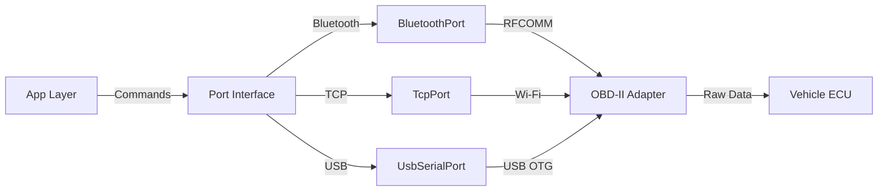

# 🔌 Hardware Module | Апаратна Інтеграція

## 📋 Призначення

Модуль **hardware** забезпечує підключення до OBD-II адаптерів через різні транспортні протоколи: Bluetooth, Wi-Fi/TCP та USB. Абстрагує фізичні комунікації для верхніх шарів.

## 🏗️ Структура

```
hardware/
└── transport/                      # Транспортний шар
    ├── src/main/kotlin/com/quantumforce_code/hardware/transport/
    │   ├── Port.kt                 - Інтерфейс порту (абстракція)
    │   ├── BluetoothPort.kt        - Bluetooth RFCOMM реалізація
    │   ├── TcpPort.kt              - Wi-Fi/TCP реалізація
    │   ├── UsbSerialPort.kt        - USB Serial реалізація
    │   └── ConnectionManager.kt    - Менеджер з'єднань
    └── build.gradle.kts
```

## 🔌 Транспортний Шар

### Port.kt (Інтерфейс)
```kotlin
// 1. File Purpose: Abstract port interface for OBD-II communication
// 2. Role: Defines contract for all transport implementations

interface Port {
    suspend fun open(): Result<Unit>
    suspend fun close(): Result<Unit>
    suspend fun write(data: ByteArray): Result<Int>
    suspend fun read(buffer: ByteArray): Result<Int>
    val isOpen: Boolean
    val connectionType: ConnectionType
}

enum class ConnectionType {
    BLUETOOTH, TCP, USB_SERIAL
}
```

### BluetoothPort.kt
- **Протокол**: Bluetooth RFCOMM (Classic Bluetooth)
- **UUID**: `00001101-0000-1000-8000-00805F9B34FB` (SPP)
- **Використання**: Більшість OBD-II адаптерів
- **Дозволи**: `BLUETOOTH`, `BLUETOOTH_ADMIN`, `BLUETOOTH_CONNECT`

**Особливості:**
- Автоматичне перепідключення при втраті зв'язку
- Управління станом paired пристроїв
- Обробка помилок Bluetooth stack

### TcpPort.kt
- **Протокол**: TCP/IP через Wi-Fi
- **Порт**: Зазвичай 35000 (залежить від адаптера)
- **Використання**: Wi-Fi OBD-II адаптери (ELM327 Wi-Fi)

**Особливості:**
- Socket timeout управління
- Reconnection на network change
- Buffer management для TCP stream

### UsbSerialPort.kt
- **Бібліотека**: [usb-serial-for-android](https://github.com/mik3y/usb-serial-for-android)
- **Протоколи**: FTDI, CH340, CP2102, тощо
- **Використання**: USB OBD-II адаптери через OTG

**Особливості:**
- Автоматичне визначення драйвера
- USB permissions handling
- Support для різних chipset'ів

### ConnectionManager.kt
```kotlin
// 1. File Purpose: Manages multiple transport connections
// 2. Role: Auto-discovery and lifecycle management of ports

class ConnectionManager {
    suspend fun discoverPorts(): List<Port>
    suspend fun connectToPort(port: Port): Result<Unit>
    suspend fun getActivePort(): Port?
    suspend fun disconnect()
}
```

**Функції:**
- Автоматичне виявлення доступних портів
- Пріоритетний вибір (USB > Bluetooth > TCP)
- Lifecycle management з автоматичним cleanup
- Event-based callbacks для UI

## 🔗 Залежності

```kotlin
dependencies {
    // Core
    implementation(libs.kotlin.stdlib)
    implementation(libs.kotlinx.coroutines.core)
    
    // USB Serial
    implementation("com.github.mik3y:usb-serial-for-android:3.5.1")
    
    // Android
    implementation(libs.androidx.core.ktx)
    
    // Internal
    implementation(project(":protocols:obd"))
}
```

## 🧪 Тестування

### Unit Tests
- Port інтерфейсів
- ConnectionManager логіка
- Error handling

### Integration Tests
- Реальні Bluetooth пристрої
- USB з mockDevice
- TCP loopback

```bash
./gradlew :hardware:transport:test
```

## 📱 Дозволи Android

```xml
<!-- Bluetooth -->
<uses-permission android:name="android.permission.BLUETOOTH" />
<uses-permission android:name="android.permission.BLUETOOTH_ADMIN" />
<uses-permission android:name="android.permission.BLUETOOTH_CONNECT" />
<uses-permission android:name="android.permission.BLUETOOTH_SCAN" />

<!-- USB OTG -->
<uses-feature android:name="android.hardware.usb.host" />

<!-- Network -->
<uses-permission android:name="android.permission.INTERNET" />
<uses-permission android:name="android.permission.ACCESS_NETWORK_STATE" />
```

## 🔧 Приклади Використання

### Bluetooth Connection
```kotlin
val bluetoothPort = BluetoothPort(device)
bluetoothPort.open().onSuccess {
    val command = "01 00\r".toByteArray()
    bluetoothPort.write(command)
    
    val buffer = ByteArray(1024)
    bluetoothPort.read(buffer)
}
```

### Connection Manager
```kotlin
val connectionManager = ConnectionManager(context)

// Auto-discover
val ports = connectionManager.discoverPorts()
val preferredPort = ports.firstOrNull { 
    it.connectionType == ConnectionType.USB_SERIAL 
}

// Connect
preferredPort?.let { port ->
    connectionManager.connectToPort(port).onSuccess {
        // Ready to communicate
    }
}
```

## 🚨 Error Handling

```kotlin
sealed class PortError {
    object NotConnected : PortError()
    object DeviceNotFound : PortError()
    object PermissionDenied : PortError()
    data class IoException(val message: String) : PortError()
    data class Timeout(val duration: Long) : PortError()
}
```

## 📊 Діаграма Комунікації



## 🎯 Підтримувані Адаптери

### Протестовані
- ELM327 v1.5 Bluetooth
- ELM327 v2.1 Wi-Fi
- FTDI-based USB adapters
- CH340 USB-UART bridges

### Сумісність
- OBD-II стандартні протоколи
- ISO 9141-2
- ISO 14230-4 (KWP2000)
- ISO 15765-4 (CAN)

## 📚 Додаткові Ресурси

- [OBD-II PIDs](https://en.wikipedia.org/wiki/OBD-II_PIDs)
- [ELM327 Datasheet](https://www.elmelectronics.com/wp-content/uploads/2016/07/ELM327DS.pdf)
- [USB Serial Android](https://github.com/mik3y/usb-serial-for-android)

---

**Пакет**: `com.quantumforce_code.hardware.transport`  
**Підтримка**: Bluetooth | TCP/IP | USB Serial  
**Min SDK**: 26 (для USB OTG та Bluetooth LE)
