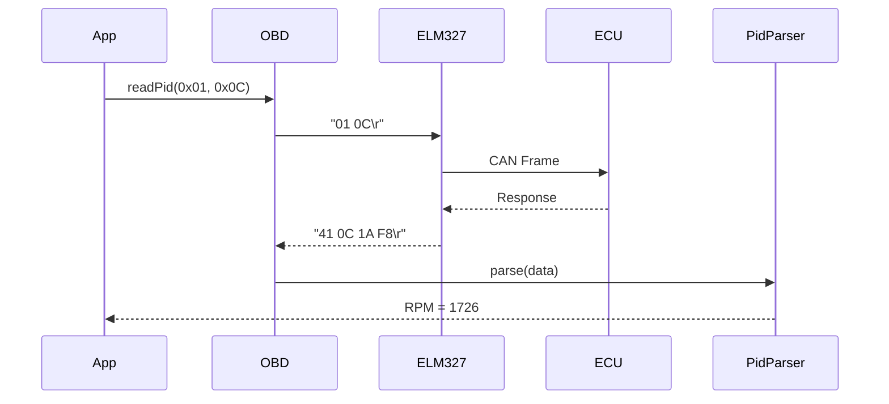

# 🔬 Protocols Module | OBD-II Протоколи

## 📋 Призначення

Модуль **protocols** реалізує OBD-II стандарти та протоколи діагностики. Відповідає за команди, парсинг відповідей, інтерпретацію PID та DTC кодів.

## 🏗️ Структура

```
protocols/
└── obd/                           # OBD-II протокол
    ├── src/main/kotlin/com/quantumforce_code/protocols/obd/
    │   ├── ObdInterface.kt        - Інтерфейс OBD команд
    │   ├── Elm327.kt              - ELM327 адаптер ініціалізація
    │   ├── ObdCommand.kt          - Модель команди
    │   ├── PidParser.kt           - Парсер PID відповідей
    │   └── DtcParser.kt           - Парсер DTC кодів
    └── build.gradle.kts
```

## 📡 OBD-II Протокол

### Стандартні Режими (Modes)
- **Mode 01**: Поточні дані (Live Data)
- **Mode 02**: Freeze Frame дані
- **Mode 03**: Читання DTC кодів
- **Mode 04**: Очистка DTC кодів
- **Mode 05**: Лямбда-зонди
- **Mode 06**: Моніторинг тестів
- **Mode 07**: Pending DTC коди
- **Mode 09**: Інформація про автомобіль (VIN)

### ObdInterface.kt
```kotlin
// 1. File Purpose: OBD-II command interface abstraction
// 2. Role: Defines contract for OBD communication layer

interface ObdInterface {
    suspend fun sendCommand(command: String): Result<String>
    suspend fun initialize(): Result<Unit>
    suspend fun readPid(mode: Int, pid: Int): Result<ByteArray>
    suspend fun readDtcCodes(): Result<List<DtcCode>>
    suspend fun clearDtcCodes(): Result<Unit>
}
```

### Elm327.kt
```kotlin
// 1. File Purpose: ELM327 adapter initialization and configuration
// 2. Role: Sets up ELM327 chip for OBD-II communication

class Elm327(private val port: Port) : ObdInterface {
    suspend fun initialize(): Result<Unit> {
        // Reset, echo off, headers, protocol auto
        sendCommand("ATZ")
        sendCommand("ATE0")
        sendCommand("ATH1")
        sendCommand("ATSP0")
    }
}
```

**Команди Ініціалізації:**
- `ATZ` - Reset адаптера
- `ATE0` - Вимкнення echo
- `ATH1` - Увімкнення headers
- `ATSP0` - Автоматичний вибір протоколу
- `AT@1` - Інформація про пристрій

### ObdCommand.kt
```kotlin
// 1. File Purpose: OBD-II command model
// 2. Role: Represents structured OBD command with metadata

data class ObdCommand(
    val mode: Int,              // 01, 03, 09, etc.
    val pid: Int?,              // PID код (nullable для mode 03)
    val expectsResponse: Boolean = true,
    val description: String
) {
    fun toRawCommand(): String {
        return if (pid != null) {
            String.format("%02X %02X", mode, pid)
        } else {
            String.format("%02X", mode)
        }
    }
}
```

**Приклади:**
- `ObdCommand(0x01, 0x0C, "Engine RPM")`
- `ObdCommand(0x01, 0x05, "Engine Coolant Temperature")`
- `ObdCommand(0x03, null, "Read DTC Codes")`

### PidParser.kt
```kotlin
// 1. File Purpose: Parses PID response data into meaningful values
// 2. Role: Converts raw hex bytes to engineering units

object PidParser {
    fun parseRpm(data: ByteArray): Int {
        // Formula: ((A * 256) + B) / 4
        return ((data[2].toInt() and 0xFF) * 256 + 
                (data[3].toInt() and 0xFF)) / 4
    }
    
    fun parseTemperature(data: ByteArray): Int {
        // Formula: A - 40 (Celsius)
        return (data[2].toInt() and 0xFF) - 40
    }
    
    fun parseSpeed(data: ByteArray): Int {
        // Formula: A (km/h)
        return data[2].toInt() and 0xFF
    }
}
```

**Підтримувані PID:**
| PID | Опис | Формула | Одиниці |
|-----|------|---------|---------|
| 0x0C | Engine RPM | ((A*256)+B)/4 | rpm |
| 0x05 | Coolant Temp | A-40 | °C |
| 0x0D | Vehicle Speed | A | km/h |
| 0x11 | Throttle Position | A*100/255 | % |
| 0x0F | Intake Air Temp | A-40 | °C |
| 0x04 | Engine Load | A*100/255 | % |

### DtcParser.kt
```kotlin
// 1. File Purpose: Parses Diagnostic Trouble Codes (DTC)
// 2. Role: Converts hex DTC codes to standardized format

object DtcParser {
    fun parseDtcCodes(rawResponse: String): List<DtcCode> {
        // Response format: "43 01 33 00 00 00 00"
        // 43 = Response to mode 03
        // 01 = Number of codes
        // 33 00 = DTC code
        
        val codes = mutableListOf<DtcCode>()
        // Parse logic...
        return codes
    }
    
    fun formatDtcCode(highByte: Int, lowByte: Int): String {
        // Convert to P0133, C0123, etc.
        val prefix = when ((highByte shr 6) and 0x03) {
            0 -> "P0"  // Powertrain
            1 -> "P1"
            2 -> "C"   // Chassis
            3 -> "B"   // Body
            else -> "U" // Network
        }
        
        val code = ((highByte and 0x3F) shl 8) or lowByte
        return String.format("%s%04X", prefix, code)
    }
}
```

**Типи DTC:**
- **P0xxx**: Powertrain (двигун, трансмісія) - загальні
- **P1xxx**: Powertrain - специфічні для виробника
- **C0xxx**: Chassis (ABS, підвіска)
- **B0xxx**: Body (подушки безпеки, центральний замок)
- **U0xxx**: Network (CAN шина)

## 📊 Підтримувані Протоколи

1. **ISO 9141-2**: Старі азіатські авто
2. **ISO 14230-4 (KWP2000)**: Європейські авто до 2008
3. **ISO 15765-4 (CAN)**: Сучасні авто (після 2008)
   - 11-bit CAN (500 kbps)
   - 29-bit CAN (500 kbps)
4. **SAE J1850 PWM**: Старі Ford
5. **SAE J1850 VPW**: Старі GM

## 🔗 Залежності

```kotlin
dependencies {
    implementation(libs.kotlin.stdlib)
    implementation(libs.kotlinx.coroutines.core)
    
    // Internal
    implementation(project(":hardware:transport"))
    implementation(project(":core:domain"))
}
```

## 🧪 Тестування

### Unit Tests
- PID parsing (всі формули)
- DTC code conversion
- Command building

### Integration Tests
- ELM327 initialization sequence
- Real adapter communication
- Protocol detection

```bash
./gradlew :protocols:obd:test
```

## 🎯 Приклади Використання

### Читання RPM
```kotlin
val elm327 = Elm327(port)
elm327.initialize()

val response = elm327.readPid(mode = 0x01, pid = 0x0C)
response.onSuccess { data ->
    val rpm = PidParser.parseRpm(data)
    println("Engine RPM: $rpm")
}
```

### Читання DTC Кодів
```kotlin
val dtcCodes = elm327.readDtcCodes()
dtcCodes.onSuccess { codes ->
    codes.forEach { dtc ->
        println("${dtc.code}: ${dtc.description}")
    }
}
```

### Очистка DTC
```kotlin
elm327.clearDtcCodes().onSuccess {
    println("DTC codes cleared")
}
```

## 📚 База Даних DTC

Модуль включає базу даних з 50,000+ DTC кодів:
- Стандартні коди (SAE J2012)
- Manufacturer-specific коди
- Опис несправності
- Можливі причини
- Рекомендації по ремонту

**Джерела:**
- SAE International Standards
- ISO 15031-6
- Manufacturer databases

## 🔧 Розширення Протоколу

Для додавання нових PID:
1. Додати константу до `ObdPids.kt`
2. Реалізувати парсер у `PidParser.kt`
3. Додати unit test
4. Оновити документацію

```kotlin
// Приклад: Fuel Level
fun parseFuelLevel(data: ByteArray): Float {
    return (data[2].toInt() and 0xFF) * 100.0f / 255.0f
}
```

## 📊 Діаграма Обробки Команд



## 🚀 Оптимізація

- **Batching**: Читання кількох PID за один запит
- **Caching**: Кешування статичних даних (VIN)
- **Priority Queue**: Пріоритет для критичних PID

---

**Пакет**: `com.quantumforce_code.protocols.obd`  
**Стандарт**: OBD-II (ISO 15031, SAE J1979)  
**Підтримка**: 50,000+ DTC кодів
