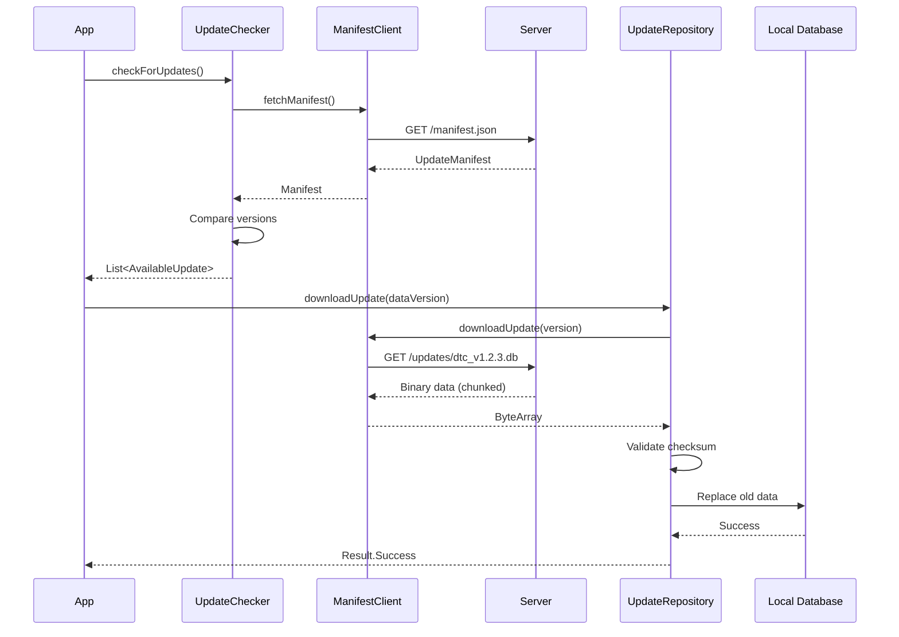

# 🔄 Updates Module | Система Оновлень

## 📋 Призначення

Модуль **updates** забезпечує оновлення баз даних DTC кодів, протоколів та контенту застосунку без необхідності публікації нової версії APK.

## 🏗️ Структура

```
updates/
├── src/main/kotlin/com/quantumforce_code/updates/
│   ├── ManifestClient.kt       - Клієнт для маніфесту оновлень
│   ├── DataVersion.kt          - Модель версій даних
│   ├── UpdateChecker.kt        - Перевірка наявності оновлень
│   └── UpdateRepository.kt     - Репозиторій для оновлень
└── build.gradle.kts
```

## 🔄 Компоненти

### ManifestClient.kt
```kotlin
// 1. File Purpose: API client for update manifest
// 2. Role: Fetches available updates from server

interface ManifestClient {
    suspend fun fetchManifest(): Result<UpdateManifest>
    suspend fun downloadUpdate(version: String): Result<ByteArray>
}

data class UpdateManifest(
    val dtcDatabase: DataVersion,
    val protocols: DataVersion,
    val translations: DataVersion
)
```

**Функції:**
- Запит manifest.json з сервера
- Порівняння версій (локальна vs сервер)
- Завантаження оновлень по частинах (chunked)
- Resume interrupted downloads

### DataVersion.kt
```kotlin
// 1. File Purpose: Data version model for updates
// 2. Role: Represents version metadata for updateable content

data class DataVersion(
    val component: ComponentType,    // DTC_DATABASE, PROTOCOLS, etc.
    val version: String,              // "1.2.3"
    val releaseDate: Long,            // Timestamp
    val size: Long,                   // Bytes
    val checksum: String,             // SHA-256 hash
    val downloadUrl: String,          // CDN URL
    val mandatory: Boolean            // Force update?
)

enum class ComponentType {
    DTC_DATABASE,      // 50k+ DTC codes
    PROTOCOLS,         // OBD-II protocol updates
    TRANSLATIONS,      // UI translations
    VEHICLE_DATABASE   // Make/model database
}
```

### UpdateChecker.kt
```kotlin
// 1. File Purpose: Checks for available updates
// 2. Role: Compares local vs server versions

class UpdateChecker(
    private val manifestClient: ManifestClient,
    private val updateRepository: UpdateRepository
) {
    suspend fun checkForUpdates(): Result<List<AvailableUpdate>>
    
    suspend fun isUpdateAvailable(
        component: ComponentType
    ): Boolean
    
    fun getLocalVersion(
        component: ComponentType
    ): String?
}

data class AvailableUpdate(
    val component: ComponentType,
    val currentVersion: String,
    val newVersion: String,
    val changesSummary: String,
    val mandatory: Boolean
)
```

### UpdateRepository.kt
```kotlin
// 1. File Purpose: Repository for update management
// 2. Role: Downloads, validates, and applies updates

class UpdateRepository(
    private val manifestClient: ManifestClient,
    private val database: AppDatabase
) {
    suspend fun downloadUpdate(
        dataVersion: DataVersion,
        progressCallback: (Int) -> Unit
    ): Result<Unit>
    
    suspend fun applyUpdate(
        component: ComponentType
    ): Result<Unit>
    
    suspend fun rollbackUpdate(
        component: ComponentType
    ): Result<Unit>
}
```

## 📦 Оновлювані Компоненти

### 1. DTC Database (50,000+ кодів)
- **Зміст**: Опис DTC кодів, причини, рішення
- **Формат**: SQLite database dump
- **Розмір**: ~10-15 MB (стиснутий)
- **Частота**: Щомісяця (нові коди з виробників)

**Структура:**
```sql
CREATE TABLE dtc_codes (
    code TEXT PRIMARY KEY,
    description TEXT,
    severity INTEGER,
    causes TEXT,      -- JSON array
    solutions TEXT    -- JSON array
);
```

### 2. Protocols (OBD-II Updates)
- **Зміст**: Нові PID, формули парсингу
- **Формат**: JSON definitions
- **Розмір**: ~1-2 MB
- **Частота**: Щокварталу (нові vehicle models)

**Приклад:**
```json
{
  "pids": [
    {
      "mode": "01",
      "pid": "A6",
      "description": "Odometer",
      "formula": "((A*256*256*256)+(B*256*256)+(C*256)+D)/10",
      "unit": "km"
    }
  ]
}
```

### 3. Translations (UI Strings)
- **Зміст**: Переклади інтерфейсу
- **Формат**: JSON або Android strings.xml
- **Розмір**: ~500 KB per language
- **Частота**: На запит (нові мови)

### 4. Vehicle Database
- **Зміст**: Make/Model/Year info
- **Формат**: SQLite
- **Розмір**: ~5 MB
- **Частота**: Щорічно (нові моделі)

## 🔄 Процес Оновлення



## 🔗 Залежності

```kotlin
dependencies {
    implementation(project(":core:domain"))
    implementation(project(":core:data"))
    
    // Network
    implementation(libs.retrofit)
    implementation(libs.okhttp)
    implementation(libs.kotlinx.serialization.json)
    
    // Coroutines
    implementation(libs.kotlinx.coroutines.android)
    
    // WorkManager (background updates)
    implementation(libs.androidx.work.runtime.ktx)
}
```

## 🧪 Тестування

### Unit Tests
- Version comparison logic
- Checksum validation
- Update state machine

### Integration Tests
- Full update flow (mock server)
- Rollback scenarios
- Network failures

```bash
./gradlew :updates:test
```

## 🎯 Приклади Використання

### Check for Updates
```kotlin
val updateChecker = UpdateChecker(manifestClient, updateRepository)

val updates = updateChecker.checkForUpdates()
updates.onSuccess { availableUpdates ->
    availableUpdates.forEach { update ->
        println("${update.component}: ${update.currentVersion} → ${update.newVersion}")
        if (update.mandatory) {
            // Force update
        }
    }
}
```

### Download and Apply Update
```kotlin
val dataVersion = DataVersion(
    component = ComponentType.DTC_DATABASE,
    version = "1.2.3",
    // ... other fields
)

updateRepository.downloadUpdate(dataVersion) { progress ->
    updateUI("Downloading: $progress%")
}.onSuccess {
    updateRepository.applyUpdate(ComponentType.DTC_DATABASE)
        .onSuccess {
            showMessage("DTC database updated!")
        }
}
```

### Background Sync (WorkManager)
```kotlin
class UpdateWorker(context: Context, params: WorkerParameters) 
    : CoroutineWorker(context, params) {
    
    override suspend fun doWork(): Result {
        val updates = updateChecker.checkForUpdates().getOrNull()
        updates?.forEach { update ->
            if (!update.mandatory) {
                updateRepository.downloadUpdate(update.dataVersion)
                updateRepository.applyUpdate(update.component)
            }
        }
        return Result.success()
    }
}

// Schedule periodic updates
val updateRequest = PeriodicWorkRequestBuilder<UpdateWorker>(
    repeatInterval = 7,
    repeatIntervalTimeUnit = TimeUnit.DAYS
).build()

WorkManager.getInstance(context).enqueue(updateRequest)
```

## 🔐 Безпека

### Checksum Validation
```kotlin
fun validateChecksum(data: ByteArray, expectedSHA256: String): Boolean {
    val digest = MessageDigest.getInstance("SHA-256")
    val hash = digest.digest(data)
    val actualSHA256 = hash.joinToString("") { "%02x".format(it) }
    return actualSHA256 == expectedSHA256
}
```

### Signed Updates
- Server підписує manifest приватним ключем
- App валідує підпис публічним ключем
- Запобігає man-in-the-middle attacks

## 📊 Update Analytics

```kotlin
data class UpdateEvent(
    val component: ComponentType,
    val fromVersion: String,
    val toVersion: String,
    val success: Boolean,
    val duration: Long,
    val errorMessage: String?
)

// Track to analytics
fun trackUpdate(event: UpdateEvent) {
    analytics.logEvent("update_completed", mapOf(
        "component" to event.component.name,
        "success" to event.success
    ))
}
```

## 🚀 Roadmap

- [ ] Delta updates (binary diff, не повний файл)
- [ ] P2P updates (між пристроями)
- [ ] Background intelligent scheduling (Wi-Fi only, charging)
- [ ] Update rollout (staged rollout 10% → 50% → 100%)
- [ ] A/B testing для updates

---

**Пакет**: `com.quantumforce_code.updates`  
**Протокол**: HTTPS, SHA-256 checksums  
**Storage**: Room Database + External Storage
